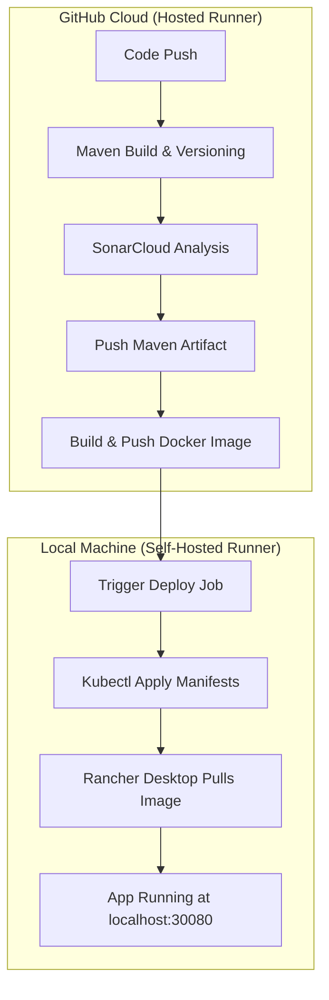
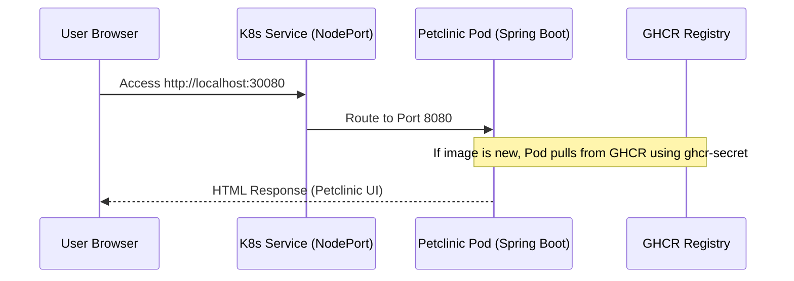

# Spring Petclinic CI/CD Documentation

This document provides a comprehensive overview of the automated CI/CD pipeline developed for the Spring Petclinic application, covering everything from versioning to local Kubernetes deployment.

## 1. Pipeline Overview

The pipeline is split into two logical phases: **Continuous Integration (CI)** running in the GitHub Cloud, and **Continuous Deployment (CD)** running locally on your laptop via a Self-Hosted Runner.

---

## 2. Key Components

### A. Automatic Versioning
We use the `versions-maven-plugin` to inject a unique version number into the `pom.xml` for every build.
*   **Mechanism**: `mvn versions:set -DnewVersion=1.0.${{ github.run_number }}`
*   **Result**: Every JAR and Docker image is tagged with a traceable version (e.g., `1.0.58`), preventing "version drift".

### B. GitHub Container Registry (GHCR)
We publish our JARs and Docker images to GitHub's own package registry.
*   **Maven Packages**: Used for the raw `.jar` dependency.
*   **Docker Registry**: Used for the container image (`ghcr.io/ezq134/petclinic-service`).

### C. Self-Hosted Runner
The CD job runs on your laptop because GitHub Cloud cannot "see" your private network.
*   **Hosted Runner**: Standard, ephemeral Ubuntu instance provided by GitHub for the "Build" job.
*   **Self-Hosted Runner**: A background process on your Windows laptop that polls GitHub for deployment tasks. This bridged the gap between the Cloud and your local **Rancher Desktop**.

---

## 3. The `build.yaml` Breakdown

The workflow is defined in `.github/workflows/build.yaml` and contains two main jobs:

#### 1. `build` Job (Runs on `ubuntu-latest`)
*   **Setup**: Configures Java 17 and caches dependencies to speed up future runs.
*   **Version**: Dynamically updates the project version.
*   **Build & Deploy**: Runs `mvn deploy`, which performs compilation, testing, and uploads the `.jar` to GitHub Packages.
*   **SonarCloud**: Identical Maven command triggers the static analysis and code coverage upload.
*   **Docker**: Uses `docker/build-push-action` to build the image following the `Dockerfile` and push it to `ghcr.io`.

#### 2. `deploy` Job (Runs on `self-hosted`)
*   **`needs: build`**: Ensures deployment only happens if the build and analysis are successful.
*   **Environment**: Executes directly on your local machine with access to your `kubectl` context.
*   **Command**: `kubectl apply -f k8s/`—this declarative command ensures that the state of your Rancher Desktop cluster matches the manifests in your repository.

---

## 4. Kubernetes Deployment Architecture

Since we are on local Windows, we used a **NodePort** service to avoid needing a Cloud Load Balancer.

### Key Manifest Files:
*   **`k8s/deployment.yaml`**: Defines the desired state (1 replica, image pull secret, CPU/Memory limits).
*   **`ghcr-secret`**: A Kubernetes secret created locally to store your GitHub Personal Access Token (PAT) for image pulling.

---

## 5. Maintenance and Future Expansion (AI DevOps)

Your next phase is to introduce an AI agent for failure analysis. The current setup is "AI Ready" because:
1.  **Observability**: SonarCloud and JaCoCo provide the metrics the AI needs to check quality.
2.  **Access**: The Self-Hosted runner gives your future Python logic direct access to `kubectl logs` if a deployment fails.
3.  **Hooks**:- [x] **Phase 1: Foundation**: Established CLI argument parsing for `--repo`, `--run-id`, etc.
- [x] **Phase 2: Log Retrieval**: Implemented chronological sorting and multi-match capture.
- [x] **Phase 3: LLM Integration**: Connected to Google Gemini with strict "Hard Failure" prioritization.
- [x] **Phase 4: Notification**: Integrated SMTP with "Context Window" log snippets for robust reporting.
- [x] **Phase 5: Portability**: Created `Dockerfile.arca` and `requirements.txt` for containerized execution.

## The "Silent Error" Challenge
We solved a critical "Signal vs Noise" problem where Gemini was distracted by Checkstyle errors. By implementing:
1. **Git Filtering**: Skipping checkout noise.
2. **Multi-Match Capture**: Capturing up to 5 error candidates per file.
3. **Context Windows**: Grabbing surrounding lines to tell the "story" of the crash.
The agent now correctly identifies Kubernetes connection failures even when Checkstyle is failing.

## ARCA Agent: Logical Flow
The agent operates as a **Sequential Relay Race**:
1.  **Researcher (`get_logs`)**: Connects to the GitHub API, downloads the logs, and filters for relevant error lines.
2.  **Thinker (`analyze_with_ai`)**: Uses the errors as context and asks the Gemini model for a root cause and fix.
3.  **Messenger (`send_email`)**: Packages the analysis into an email and sends it via encrypted SMTP.

---

### Useful Commands Reference

| Action | Command |
| :--- | :--- |
| **Check Deployment Status** | `kubectl get pods` |
| **View Live Logs** | `kubectl logs -f deployment/petclinic-service` |
| **Check Service Port** | `kubectl get svc` |
| **Delete App** | `kubectl delete -f k8s/` |
